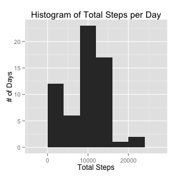
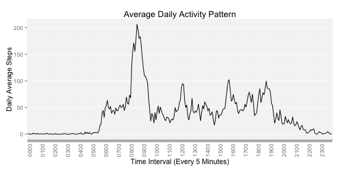
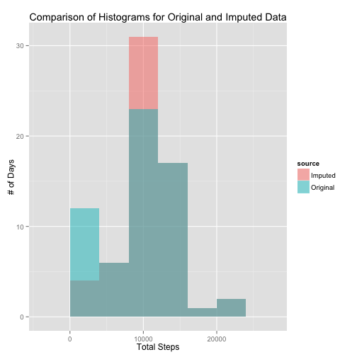
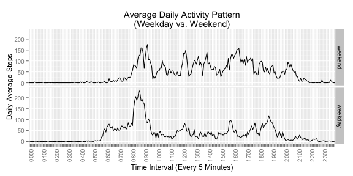

# Reproducible Research: Peer Assessment 1

## Script Setup

The ggplot2 library is used for plotting, so include it.


```r
library(ggplot2)
```

## Loading and preprocessing the data

Loading the data unzips the available ZIP file if the CSV file does not
already exist.


```r
# Variables for data file locations
zipfile <- "activity.zip"
datafile <- "activity.csv"

# If the CSV file doesn't exist, unzip the zip file.
if (!file.exists(datafile)) {
    writeLines(paste("Unzipping", zipfile))
    unzip(zipfile)
}

# Load the data
writeLines(paste("Data file", datafile, "exists, loading data."))
```

```
## Data file activity.csv exists, loading data.
```

```r
activitydata <- read.csv(datafile, stringsAsFactors=FALSE)
```

Review the data structure of the read in data.


```r
str(activitydata)
```

```
## 'data.frame':	17568 obs. of  3 variables:
##  $ steps   : int  NA NA NA NA NA NA NA NA NA NA ...
##  $ date    : chr  "2012-10-01" "2012-10-01" "2012-10-01" "2012-10-01" ...
##  $ interval: int  0 5 10 15 20 25 30 35 40 45 ...
```

The `date` column will be more convenient as `Date` objects rather than as
strings. So it is converted.


```r
activitydata <- transform(activitydata, date=as.Date(date, format="%Y-%m-%d"))
```

The `interval` column is an integer in `HHMM` format, with leading
zeroes removed, spaced every 5 minutes. This means that a plot using the
interval column will be unevenly spaced, as you jump from 1055 to 1100,
for example.

A new `intervalf` column is created by converting the time
intervals into a factor. The conversion makes the intervals appear
equidistantly on later plots. Zero pad the interval to a width of 4
for pretty tick labels later.


```r
activitydata <- transform(activitydata, intervalf=as.factor(sprintf("%04d", interval)))
```

The transformations are reviewed to make sure they happened
properly.


```r
str(activitydata)
```

```
## 'data.frame':	17568 obs. of  4 variables:
##  $ steps    : int  NA NA NA NA NA NA NA NA NA NA ...
##  $ date     : Date, format: "2012-10-01" "2012-10-01" ...
##  $ interval : int  0 5 10 15 20 25 30 35 40 45 ...
##  $ intervalf: Factor w/ 288 levels "0000","0005",..: 1 2 3 4 5 6 7 8 9 10 ...
```

## What is mean total number of steps taken per day?

### Instructions

> For this part of the assignment, you can ignore the missing values in
> the dataset.
>
> 1. Make a histogram of the total number of steps taken each day
>
> 2. Calculate and report the **mean** and **median** total number of steps 
>    taken per day

### Results
Per the instructions, a histogram of the total
number of steps per day is plotted. 
The data are aggregated by date using the
`sum` function, ignoring missing values with `na.rm=TRUE`.
For `aggregate` the `na.action` parameter is set to allow NA values
to pass through to the sums. Otherwise, days with partial data are omitted.
In effect, this treats missing data as zeroes.


```r
totalsteps <- aggregate(steps ~ date, activitydata, sum, na.rm=TRUE, na.action=na.pass)
qplot(steps, data=totalsteps, geom="histogram", binwidth=4000,
      xlab="Total Steps",
      ylab="# of Days",
      main="Histogram of Total Steps per Day")
```

 

The instructions for the second part of this section
ask for the mean and median total number of steps per day.
Again, missing values are ignored using `na.rm=TRUE`.


```r
meantotal <- with(totalsteps, mean(steps, na.rm=TRUE))
mediantotal <- with(totalsteps, median(steps, na.rm=TRUE))
writeLines(c(paste("The mean total steps per day is", meantotal),
             paste("The median total steps per day is", mediantotal)))
```

```
## The mean total steps per day is 9354.22950819672
## The median total steps per day is 10395
```

## What is the average daily activity pattern?

### Instructions

> 1. Make a time series plot (i.e. `type = "l"`) of the 5-minute interval 
> (x-axis) and the average number of steps taken, averaged across all days (y-axis)
>
> 2. Which 5-minute interval, on average across all the days in the dataset, 
> contains the maximum number of steps?

### Results
The daily activity pattern is calculated by computing the mean number
of steps during each time interval across all days. Missing values are
ignored by `sum` with `na.rm=TRUE`. Intervals with partial data are maintained
with `na.action=na.pass`. The factor version of the interval is used to treat 
intervals as equal width.


```r
dailysteps <- aggregate(steps ~ intervalf, activitydata, mean, 
                        na.rm=TRUE, na.action=na.pass)
ticklabels <- ifelse(as.numeric(dailysteps$intervalf) %% 12 == 1, 
                     as.character(dailysteps$intervalf), "")
g <- ggplot(dailysteps, aes(x=intervalf, y=steps)) + geom_line(aes(group=1))
g + scale_x_discrete(labels=ticklabels) + 
    theme(axis.text.x=element_text(angle=90)) +
    labs(title="Average Daily Activity Pattern",
         x="Time Interval (Every 5 Minutes)",
         y="Daily Average Steps")
```

 

The interval with the maximum number of steps on average is computed
with the following code.


```r
maxinterval <- with(dailysteps, intervalf[which.max(steps)])
writeLines(paste("The interval with the maximum daily average steps is", maxinterval))
```

```
## The interval with the maximum daily average steps is 0835
```


## Imputing missing values

### Instructions

> 1. Calculate and report the total number of missing values in the dataset 
> (i.e. the total number of rows with `NA`s)
>
> 2. Devise a strategy for filling in all of the missing values in the dataset. 
> The strategy does not need to be sophisticated. For example, you could use
> the mean/median for that day, or the mean for that 5-minute interval, etc.
>
> 3. Create a new dataset that is equal to the original dataset but with the
> missing data filled in.
>
> 4. Make a histogram of the total number of steps taken each day and Calculate
> and report the **mean** and **median** total number of steps taken per day. 
> Do these values differ from the estimates from the first part of the 
> assignment? What is the impact of imputing missing data on the estimates of
> the total daily number of steps?

### Results
The number of rows with missing values is computed by checking if any
value within a row is `NA` using a combination of `apply` and `any`.


```r
missingrows <- which(apply(activitydata, 1, function(x) any(is.na(x))))
writeLines(paste("There are", length(missingrows), "missing rows."))
```

```
## There are 2304 missing rows.
```

It turns out that only the `steps` column contains missing data
as the following code shows.


```r
with(activitydata, {
    writeLines(paste("steps is missing", length(which(is.na(steps))), "values"))
    writeLines(paste("interval is missing", length(which(is.na(interval))), "values"))
    writeLines(paste("date is missing", length(which(is.na(date))), "values"))
    })
```

```
## steps is missing 2304 values
## interval is missing 0 values
## date is missing 0 values
```

Missing data is replaced with the average for the same time interval.
The `imputeddata` variable is used to store the imputed results.
Averages are obtained from the `dailysteps` variable computed above,
which contains the average steps measured daily for each time interval.
After the missing data is imputed, a check verifies there are no longer
any missing values.


```r
imputeddata  <- activitydata
matchingavgs <- match(activitydata$intervalf[missingrows],
                      dailysteps$intervalf)
imputeddata$steps[missingrows] <- dailysteps$steps[matchingavgs]
any(is.na(imputeddata))
```

```
## [1] FALSE
```

A histogram with the imputed data is plotted.


```r
imputedsteps <- aggregate(steps ~ date, imputeddata, sum, na.rm=TRUE, na.action=na.pass)
qplot(steps, data=imputedsteps, geom="histogram", binwidth=4000,
      xlab="Total Steps",
      ylab="# of Days",
      main="Histogram of Total Steps per Day\n(Imputed Data)")
```

 

To see the differences between the original and imputed data, the
two data sets are merged and then the histograms plotted together.


```r
combinedsteps <- c(totalsteps$steps,imputedsteps$steps)
combinedsource <- c( rep("Original",nrow(totalsteps)),
                     rep("Imputed", nrow(imputedsteps)) )
combineddf <- data.frame(steps=combinedsteps,
                         source=as.factor(combinedsource))
cmpg <- ggplot(combineddf, aes(x=steps, fill=source))
cmpg + geom_histogram(binwidth=4000, alpha=.5, position="identity") +
    labs(title="Comparison of Histograms for Original and Imputed Data",
         x="Total Steps", y="# of Days")
```

 


The mean and median of the imputed data set now follows.


```r
meanimputed <- with(imputedsteps, mean(steps, na.rm=TRUE))
medianimputed <- with(imputedsteps, median(steps, na.rm=TRUE))
writeLines(c(paste("The mean total steps (imputed) per day is", meanimputed),
             paste("The median total steps (imputed) per day is", medianimputed)))
```

```
## The mean total steps (imputed) per day is 10766.1886792453
## The median total steps (imputed) per day is 10766.1886792453
```

The median and mean of the imputed data are now identical.

The differences in the original and imputed means and medians are


```r
writeLines(c(paste("The difference in means is: ", meantotal - meanimputed),
             paste("The difference in medians is: ", mediantotal - medianimputed)))
```

```
## The difference in means is:  -1411.95917104856
## The difference in medians is:  -371.188679245282
```

The data in the imputed data set has more steps per day on average,
which is expected since imputing missing values increases the total
steps for days containing missing data.

## Are there differences in activity patterns between weekdays and weekends?

### Instructions

> 1. Create a new factor variable in the dataset with two levels -- "weekday"
> and "weekend" indicating whether a given date is a weekday or weekend day.
>
> 1. Make a panel plot containing a time series plot (i.e. `type = "l"`) of the
> 5-minute interval (x-axis) and the average number of steps taken, averaged
> across all weekday days or weekend days (y-axis).

### Results
Add a factor variable indicating whether or not the day is a weekday
or weekend.


```r
weekday <- c("Monday", "Tuesday", "Wednesday", "Thursday", "Friday")
isweekday <- with(activitydata, weekdays(date) %in% weekday)
activitydata$daytype <- factor(isweekday, labels=c("weekend", "weekday"))
with(activitydata, table(daytype))
```

```
## daytype
## weekend weekday 
##    4608   12960
```

Aggregate the data by interval and day type for comparing activity patterns.
The original data set is used, and missing values are ignored.


```r
daytypesteps <- aggregate(steps ~ intervalf + daytype, activitydata, mean, 
                          na.rm=TRUE, na.action=na.pass)
dtg <- ggplot(daytypesteps, aes(x=intervalf, y=steps)) + geom_line(aes(group=1))
dtg + facet_grid(daytype ~ .) + 
    scale_x_discrete(labels=ticklabels) +
    theme(axis.text.x=element_text(angle=90)) +
    labs(title="Average Daily Activity Pattern\n(Weekday vs. Weekend)",
         x="Time Interval (Every 5 Minutes)",
         y="Daily Average Steps")
```

 

On the weekend, activity is spread more evenly throughout the day. During
the weekdays, activity starts earlier and peaks earlier than on the weekend.
