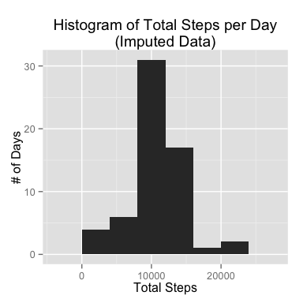

# Reproducible Research: Peer Assessment 1

## Script Setup

The ggplot2 library is used for plotting, so include it.


```r
library(ggplot2)
```

## Loading and preprocessing the data

Loading the data unzips the available ZIP file if the CSV file does not
already exist.


```r
# Variables for data file locations
zipfile <- "activity.zip"
datafile <- "activity.csv"

# If the CSV file doesn't exist, unzip the zip file.
if (!file.exists(datafile)) {
    writeLines(paste("Unzipping", zipfile))
    unzip(zipfile)
}

# Load the data
writeLines(paste("Data file", datafile, "exists, loading data."))
```

```
## Data file activity.csv exists, loading data.
```

```r
activitydata <- read.csv(datafile, stringsAsFactors=FALSE)
```

Review the data structure of the read in data.


```r
str(activitydata)
```

```
## 'data.frame':	17568 obs. of  3 variables:
##  $ steps   : int  NA NA NA NA NA NA NA NA NA NA ...
##  $ date    : chr  "2012-10-01" "2012-10-01" "2012-10-01" "2012-10-01" ...
##  $ interval: int  0 5 10 15 20 25 30 35 40 45 ...
```

The date column will be more convenient as `Date` objects rather than as
strings. Two additional columns are also created. The `minutes` column
is a transformation of the `interval` values 
into the number of minutes into the day.
The `datetime` column creates a combined date and time column
for plotting time series data later. The `GMT` timezone is used
to keep proper values regardless of the local timezone
of code execution.


```r
activitydata <- transform(activitydata, date=as.Date(date, format="%Y-%m-%d"))
activitydata <- transform(activitydata, minutes=interval%/%100 * 60 + interval %% 60)
activitydata <- transform(activitydata, datetime=as.POSIXct(minutes * 60, origin=date, tz="GMT"))
activitydata <- transform(activitydata, intervalf=as.factor(interval))
str(activitydata)
```

```
## 'data.frame':	17568 obs. of  6 variables:
##  $ steps    : int  NA NA NA NA NA NA NA NA NA NA ...
##  $ date     : Date, format: "2012-10-01" "2012-10-01" ...
##  $ interval : int  0 5 10 15 20 25 30 35 40 45 ...
##  $ minutes  : num  0 5 10 15 20 25 30 35 40 45 ...
##  $ datetime : POSIXct, format: "2012-10-01 00:00:00" "2012-10-01 00:05:00" ...
##  $ intervalf: Factor w/ 288 levels "0","5","10","15",..: 1 2 3 4 5 6 7 8 9 10 ...
```

## What is mean total number of steps taken per day?

Per the instructions, a histogram of the total
number of steps per day is plotted. 
The data are aggregated by date using the
`sum` function, ignoring missing values.


```r
totalsteps <- aggregate(steps ~ date, activitydata, sum, na.rm=T)
qplot(steps, data=totalsteps, geom="histogram", binwidth=4000,
      xlab="Total Steps",
      ylab="# of Days",
      main="Histogram of Total Steps per Day")
```

 

The instructions for the second part of this section
ask for the mean and median total number of steps per day.
Again, missing values are ignored.


```r
meantotal <- with(totalsteps, mean(steps, na.rm=TRUE))
mediantotal <- with(totalsteps, median(steps, na.rm=TRUE))
writeLines(c(paste("The mean total steps per day is", meantotal),
             paste("The median total steps per day is", mediantotal)))
```

```
## The mean total steps per day is 10766.1886792453
## The median total steps per day is 10765
```

## What is the average daily activity pattern?

The daily activity pattern is calculated by computing the mean number
of steps during each time interval across all days. Missing values are
ignored. The factor version of the interval is used to treat intervals
as equal width.


```r
dailysteps <- aggregate(steps ~ intervalf, activitydata, mean, na.rm=TRUE)
g <- ggplot(dailysteps, aes(x=intervalf, y=steps)) + geom_line(aes(group=1))
g + theme(axis.text.x=element_blank()) + 
    labs(title="Average Daily Activity Pattern",
         x="Time Interval (Every 5 Minutes)",
         y="Daily Average Steps")
```

 

The interval with the maximum number of steps on average is computed
with the following code.


```r
maxinterval <- with(dailysteps, intervalf[which.max(steps)])
writeLines(paste("The interval with the maximum daily average steps is", maxinterval))
```

```
## The interval with the maximum daily average steps is 835
```


## Imputing missing values

The number of rows with missing values is computed as follows.


```r
missingrows <- which(apply(activitydata,1,function(x) any(is.na(x))))
writeLines(paste("There are", length(missingrows), "missing rows."))
```

```
## There are 2304 missing rows.
```

It turns out that only the `steps` column contains missing data
as the following code shows.


```r
with(activitydata, {
    writeLines(paste("steps is missing",length(which(is.na(steps))), "values"))
    writeLines(paste("interval is missing", length(which(is.na(interval))), "values"))
    writeLines(paste("date is missing", length(which(is.na(date))), "values"))
    })
```

```
## steps is missing 2304 values
## interval is missing 0 values
## date is missing 0 values
```

Missing data is replaced with the average for the same time interval.
Make sure to verify that there are no missing values in the imputeddata.


```r
imputeddata  <- activitydata
matchingavgs <- match(activitydata$intervalf[missingrows],
                       dailysteps$intervalf)
imputeddata$steps[missingrows] <- dailysteps$steps[matchingavgs]
any(is.na(imputeddata))
```

```
## [1] FALSE
```

A report similar to the initial report is generated. First, a new histogram
with the imputed data.


```r
imputedsteps <- aggregate(steps ~ date, imputeddata, sum, na.rm=T)
qplot(steps, data=imputedsteps, geom="histogram", binwidth=4000,
      xlab="Total Steps",
      ylab="# of Days",
      main="Histogram of Total Steps per Day\n(Imputed Data)")
```

 

The histogram shows more days with daily totals around 10,000 steps,
but not many other changes. TODO: Compute the difference in the histograms.

The mean and median of the imputed data set now follows.


```r
meanimputed <- with(imputedsteps, mean(steps, na.rm=TRUE))
medianimputed <- with(imputedsteps, median(steps, na.rm=TRUE))
writeLines(c(paste("The mean total steps (imputed) per day is", meanimputed),
             paste("The median total steps (imputed) per day is", medianimputed)))
```

```
## The mean total steps (imputed) per day is 10766.1886792453
## The median total steps (imputed) per day is 10766.1886792453
```

The mean has not changed from the original data set, but the median has
changed slightly and now matches the mean.

## Are there differences in activity patterns between weekdays and weekends?

Add a factor variable indicating whether or not the day is a weekday
or weekend.


```r
weekday <- c("Monday", "Tuesday", "Wednesday", "Thursday", "Friday")
isweekday <- with(activitydata,weekdays(date) %in% weekday)
activitydata$daytype <- factor(isweekday, labels=c("weekend", "weekday"))
with(activitydata, table(daytype))
```

```
## daytype
## weekend weekday 
##    4608   12960
```

Aggregate the data by interval and day type for comparing activity patterns.
The original data set is used, and missing values are ignored.


```r
daytypesteps <- aggregate(steps ~ intervalf + daytype, activitydata, mean, na.rm=TRUE)
dtg <- ggplot(daytypesteps, aes(x=intervalf, y=steps)) + geom_line(aes(group=1))
dtg + facet_grid(daytype ~ .) + theme(axis.text.x=element_blank()) + 
    labs(title="Average Daily Activity Pattern\n(Weekday vs. Weekend)",
         x="Time Interval (Every 5 Minutes)",
         y="Daily Average Steps")
```

 

On the weekend, activity is spread more evenly throughout the day. During
the weekdays, activity starts earlier and peaks earlier than on the weekend.
